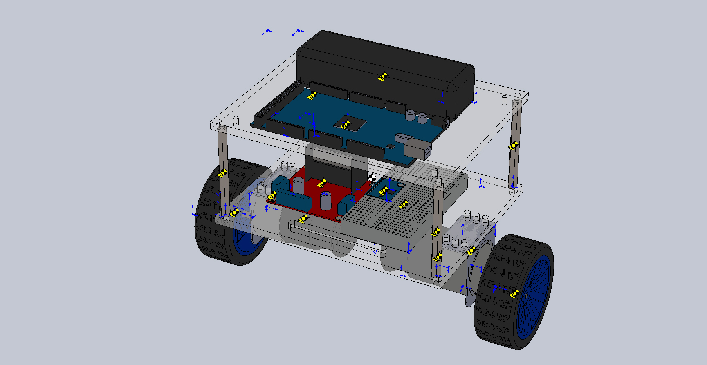

# Objective

The objective is to make a remote control robot capable of balancing itself using Linear Quadratic Regulator Control.

# Components
- Arduino Mega
- MPU 6050
- DC Motors with encoders
- Xbee Module
- Motor Driver
- 12V Lipo Battery
- Chassis
- Breadboard
- Wheels

# 3D Model of Chassis
- 3D Modelling of robot is done in solidworks, and those files are available in 3D Model folder.

# Code Structure

## main.ino
- This is the file in which code for controlling Arduino Mega is written.

## Encoders
- In these files, class of encoders is defined.  
- X4 encoding is used.

## Motor
- In these files, class of motor is defined.
- Encoder is a inner class of motor.

## TimerInterruptsLib
- Code for timer interrupts is written in this file.

## RCModule
- In this files, class of Xbee is defined.

# Control Architecture

# Requirements
- Arduino IDE
  - digitalWriteFast.h
  - MPU6050
  - MPULib
  - I2C
  - I2Cdev
  
- Octave
  - "control" package
