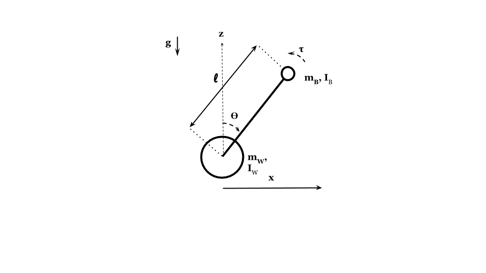
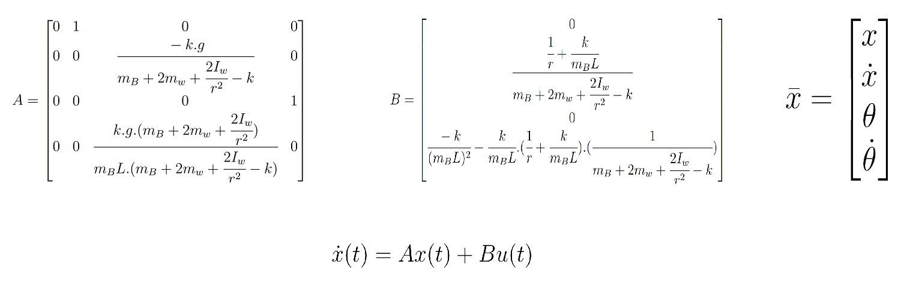
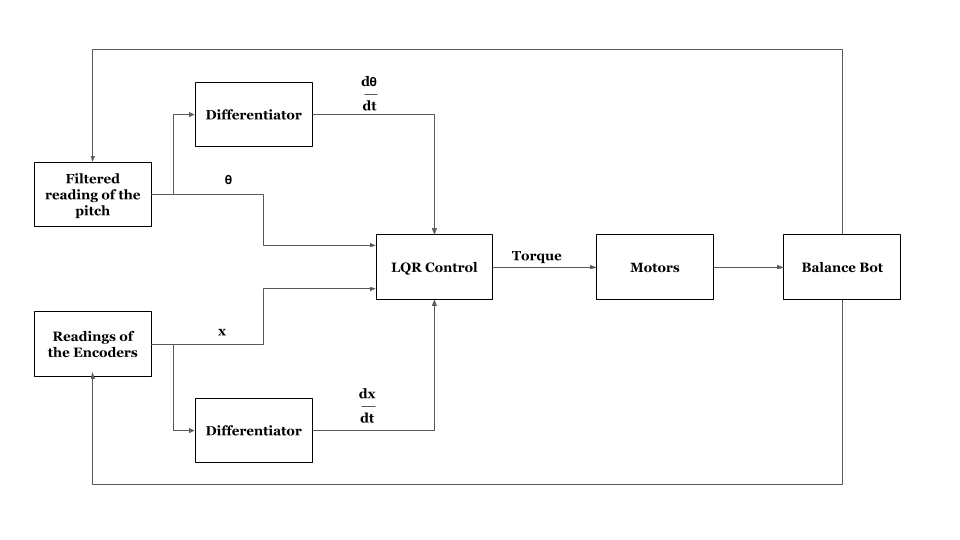

# Objective

The objective is to make a remote control robot capable of balancing itself using Linear Quadratic Regulator (LQR) Control.

# Components
- Arduino Mega
- MPU 6050 (Accelerometer + Gyroscope)
- DC Motors with quadrature encoders
- Xbee Module 
- Motor Driver (L298N)
- 12V Lipo Battery
- Chassis
- Breadboard
- Wheels

# 3D Model of Chassis
- 3D Modelling of robot is done in solidworks, and those files are available in 3D Model folder.

# Mathematical Model
- Derivations are given in the folder Mathematical Model.

- State-Space Equation

# Control Architecture

# Code Structure

## main.ino
- This is the file in which code for controlling Arduino Mega is written.

## Encoders
- In these files, class of encoders is defined.  
- X4 encoding is used.

## Motor
- In these files, class of motor is defined.
- Encoder is a inner class of motor.

## TimerInterruptsLib
- Timers 3, 4, and 5 are initialized in this library.

## RCModule
- In this files, class of Xbee is defined.

## Octave
- In this files, dicrete state-space model of robot is calculated from its continuous state-space model.
- State variables are simulated from given Q and R matrix.

# Requirements
- Arduino IDE
  - digitalWriteFast.h
  - MPU6050
  - MPULib
  - I2C
  - I2Cdev
  
- Octave
  - "control" package
